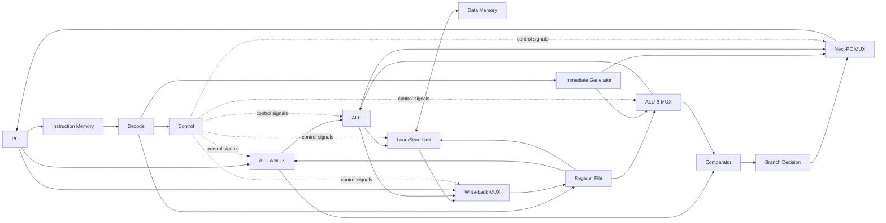

# RV32I Single-Cycle RISC-V CPU

This project implements a 32-bit RISC-V CPU in SystemVerilog for educational and FPGA experiments. The current core uses a **single-cycle Harvard architecture**: instruction memory and data memory are separate, and each instruction completes fetch, decode, execution, memory access, and write-back within one clock cycle.

The top-level module is `riscv_cpu`. It currently exposes only the `sysclk` clock and active-high `reset` inputs. The processor implements commonly used RV32I integer, branch, jump, and load/store instructions. It does not include pipelining, CSRs, interrupts, or multiply/divide extensions.

## Design Overview

| Item | Current implementation |
| --- | --- |
| Instruction set | RV32I subset |
| Data width | 32 bits |
| Registers | 32 general-purpose registers; `x0` is always zero |
| Microarchitecture | Single-cycle, non-pipelined |
| Memory architecture | Separate instruction ROM and data RAM |
| Instruction memory | 256 × 32 bits, 1 KiB total |
| Data memory | 256 × 32 bits, 1 KiB total |
| Reset vector | `0x0000_0000` |
| Endianness | Little-endian |
| FPGA constraints | Digilent Cmod A7 with a 12 MHz onboard clock |

### Datapath



A normal instruction follows this sequence:

1. `pc` supplies the current address, and `imem` reads the 32-bit instruction combinationally.
2. `decode` splits the instruction into fields, `control` generates datapath control signals, and `imm_gen` constructs the immediate value.
3. `registers` reads `rs1` and `rs2` combinationally. Multiplexers select the ALU and comparator operands.
4. `alu` performs the arithmetic, logical, or address calculation. For branch instructions, `comparator` and `branch` determine whether the branch is taken.
5. Load and store instructions access `dmem` through `lsu`. The ALU result, loaded data, or `PC + 4` is selected and written back to `rd`.
6. The PC, register-file writes, and data-memory writes are updated on the rising clock edge.

The single-cycle architecture does not have pipeline hazards. However, its combinational path extends from instruction fetch through execution, memory access, and write-back, so the longest combinational path limits the maximum clock frequency.

## Module Descriptions

### `riscv_pkg.sv` — Shared Types and Instruction Constants

Defines the parameters, enumerations, and instruction encodings shared by the CPU:

- `XLEN=32` and reset address `PC_START=0`.
- Immediate formats `IMM_I/S/B/U/J`.
- ALU operations and ALU operand selections.
- Write-back and next-PC selections.
- Memory access widths and signedness.
- RV32I opcode, `funct3`, and `funct7` constants.

This package must be compiled before any RTL module that imports it. Although `XLEN` is defined as a parameter, most of the datapath is explicitly declared as 32 bits, so the current design is effectively fixed to RV32.

### `cpu_top.sv` — CPU Top Level and Datapath Integration

The module is named `riscv_cpu`. It instantiates and connects all submodules and implements the main datapath multiplexers:

- Selects either `rs1` or the current PC as ALU operand A according to `alu_src_a_sel`.
- Selects either `rs2` or the immediate as ALU operand B according to `alu_src_b_sel`.
- Selects the ALU result, memory data, `PC + 4`, or comparison result for register write-back.
- Selects the sequential address, conditional branch target, JAL target, JALR target, or trap address as the next PC.

The external `reset` input is active high. The top level inverts it to create the internal active-low synchronous reset signal `reset_n`. It also contains a `cycle_counter` used only for debugging.

The top level combines illegal-instruction, misaligned-load, and misaligned-store conditions into an `exception` signal. The current implementation does not connect `exception` to the trap path and does not use it to suppress register or memory writes.

### `pc_if.sv` — Program Counter (IF Stage)

Stores the current instruction address:

- Updates `current_pc` with `next_pc` on each rising clock edge.
- Synchronously resets to `PC_START` on a rising edge when `reset_n` is low.
- Advances by four bytes during normal sequential execution.

### `imem_if.sv` — Instruction Memory (IF Stage)

Implements a `256 × 32-bit` combinational-read ROM:

- Loads machine code with `$readmemh("asm.mem", instr_rom)` during simulation or memory initialization.
- Uses `addr[31:2]` as the word index and ignores the lowest two address bits.
- Has a nominal address range of `0x0000_0000` through `0x0000_03ff`.

The `asm.mem` path is relative to the simulator's working directory, which is not necessarily the RTL source directory.

### `branch_predict_if.sv` — Branch Predictor (IF Stage)

Implements the current static branch prediction policy. It always predicts that control flow will continue at `PC + 4` and passes the predicted direction and address into the pipeline.

### `decode_id.sv` — Instruction Field Decoder (ID Stage)

Directly extracts the following fields from the 32-bit instruction:

- `opcode`
- `funct3`
- `funct7`
- `rs1`
- `rs2`
- `rd`

It also selects the immediate format based on the opcode. This module only separates instruction fields and classifies the immediate; `control` is responsible for checking whether an instruction encoding is valid.

### `control_id.sv` — Main Control Unit (ID Stage)

Generates the single-cycle datapath control signals from `opcode`, `funct3`, and `funct7`:

- Register write enable `reg_we`.
- Memory read and write intent signals `mem_re` and `mem_we`.
- ALU operation and ALU operand selections.
- Register write-back source.
- Next-PC selection.
- Load/store width and signedness.
- Illegal-instruction flag `illegal_instr`.

`mem_re` is not currently connected to `dmem` because the data RAM uses asynchronous reads. It only represents the controller's intent to perform a read. The `debug` signal is asserted for load instructions and preserved with a synthesis attribute for observation.

ALU opcode decode is combined with other control signals

### `registers_id_wb.sv` — General-Purpose Register File (ID/WB Stages)

Implements 32 general-purpose 32-bit registers:

- Two combinational read ports for `rs1` and `rs2`.
- One rising-edge write port for `rd`.
- Reads from `x0` always return zero.
- Writes to `x0` are ignored.
- All registers are synchronously cleared on reset.

### `imm_gen_id.sv` — Immediate Generator (ID Stage)

Reconstructs and extends the instruction immediate according to the format selected by `decode`:

- I-, S-, B-, and J-type immediates are sign-extended.
- U-type immediates occupy the upper 20 bits, with the lower 12 bits set to zero.
- B- and J-type immediates have a zero least-significant bit to form a two-byte-aligned offset.

### `comparator_ex.sv` — Operand Comparator (EX Stage)

Produces three comparison results in parallel:

- `eq`: equality comparison.
- `less_signed`: signed less-than comparison.
- `less_unsigned`: unsigned less-than comparison.

These results are shared by SLT/SLTU ALU operations and conditional branch decisions.

### `branch_ex.sv` — Conditional Branch Decision (EX Stage)

Generates the `take` signal from the branch instruction's `funct3` and the comparator outputs:

| Instruction | Branch condition |
| --- | --- |
| `BEQ` | `rs1 == rs2` |
| `BNE` | `rs1 != rs2` |
| `BLT` | signed `rs1 < rs2` |
| `BGE` | signed `rs1 >= rs2` |
| `BLTU` | unsigned `rs1 < rs2` |
| `BGEU` | unsigned `rs1 >= rs2` |

When the branch is taken, the next PC is `current_pc + imm`; otherwise, it is `current_pc + 4`.

### `alu_ex.sv` — Arithmetic Logic Unit (EX Stage)

Supports the following operations:

- Addition and subtraction.
- AND, OR, and XOR.
- Logical left shift, logical right shift, and arithmetic right shift.
- Signed and unsigned less-than comparisons.
- Copying operand B for LUI.

Shift operations use only the lowest five bits of operand B, matching the RV32 shift range.

### `lsu_mem.sv` — Load/Store Unit (MEM Stage)

Sits between the CPU datapath and `dmem` and handles accesses of different widths:

- Uses the low address bits to select the target byte or halfword.
- Generates the four-bit byte write enable `wstrb` for stores.
- Moves store data into the correct byte lanes.
- Selects the requested byte or halfword for loads and applies sign extension or zero extension.
- Checks the natural alignment of halfword and word accesses and generates load/store misalignment flags.

Data is arranged in little-endian order. For example, byte offset zero maps to the lowest eight bits of a 32-bit memory word.

### `dmem_mem.sv` — Data Memory (MEM Stage)

Implements a `256 × 32-bit` data RAM:

- Reads are combinational.
- Writes occur on the rising clock edge.
- `wstrb[3:0]` independently controls the four byte lanes, enabling `SB`, `SH`, and `SW`.
- The array is initialized to zero in its declaration but has no runtime reset port.
- The nominal address range is `0x0000_0000` through `0x0000_03ff`.

Because reads are asynchronous, FPGA tools may not infer a synchronous block RAM for this memory.

### `cpu_tb.sv` — Basic Simulation Testbench

Instantiates `riscv_cpu` and generates:

- A 10 ns simulation clock period, equivalent to 100 MHz.
- An active-high reset lasting for one rising clock edge.
- Automatic simulation termination after 40 clock cycles.

The testbench does not automatically check register or memory results. It is currently intended mainly for waveform-based inspection.

## Supported Instructions

| Category | Instructions |
| --- | --- |
| Register arithmetic and logic | `ADD` `SUB` `SLL` `SLT` `SLTU` `XOR` `SRL` `SRA` `OR` `AND` |
| Immediate arithmetic and logic | `ADDI` `SLTI` `SLTIU` `XORI` `ORI` `ANDI` `SLLI` `SRLI` `SRAI` |
| Upper-immediate operations | `LUI` `AUIPC` |
| Conditional branches | `BEQ` `BNE` `BLT` `BGE` `BLTU` `BGEU` |
| Jumps | `JAL` `JALR` |
| Loads | `LB` `LH` `LW` `LBU` `LHU` |
| Stores | `SB` `SH` `SW` |

The design does not implement `FENCE`, `ECALL`, `EBREAK`, CSR instructions, the privileged architecture, or the M/A/F/D/C extensions.

## PC and Write-Back Selection

### Next-PC Selection

| `pc_sel` | Next address |
| --- | --- |
| `PC_NEXT` | `PC + 4` |
| `PC_BRANCH` | `PC + imm` when taken; otherwise `PC + 4` |
| `PC_JAL` | ALU result `PC + imm` |
| `PC_JALR` | ALU result `rs1 + imm`, with bit zero cleared |
| `PC_TRAP` | `0x0000_0000`; the current controller never selects it |

### Register Write-Back Selection

| `wb_sel` | Write-back data |
| --- | --- |
| `WB_ALU` | ALU result |
| `WB_MEM` | Load data processed by the LSU |
| `WB_PC` | `PC + 4`, used by JAL and JALR to save the return address |
| `WB_CMP` | Equality result; no current instruction uses this source |

## Program Build and Loading

### Required Tools

- GNU Make.
- A RISC-V GNU Toolchain using the `riscv64-unknown-elf-` command prefix.
- Vivado or another simulator with SystemVerilog support.

The Makefile uses `-march=rv32i -mabi=ilp32 -nostdlib`. The entry point is `_start`, placed at address `0x0000_0000`.

### Generating Machine Code

Run the following command from the `src` directory:

```sh
make PRGM=sum
```

`PRGM` is the filename under `asm/` without the `.s` extension. The build products are written to `build/`:

```text
build/asm.elf   ELF executable
build/asm.mem   hexadecimal file for $readmemh
build/asm.dump  disassembly listing
```

The Makefile also defines an optional `build/asm.bin` raw binary target, but the default `all` target does not generate it.

`imem_if.sv` always reads a file named `asm.mem`, while the Makefile generates `build/asm.mem`. Before simulation, copy it into the simulator's working directory or add `build/asm.mem` to Vivado as a memory initialization file. For example, when running the simulator from the source directory:

```powershell
Copy-Item .\build\asm.mem .\asm.mem
```

### Compilation Order

When configuring a simulator manually:

1. Compile `riscv_pkg.sv` first.
2. Compile the submodules.
3. Compile `cpu_top.sv`.
4. Compile `cpu_tb.sv` last and select `cpu_tb` as the simulation top.

`script.tcl` recursively adds the signals below `uut` to the waveform window. `script_lite.tcl` adds only key signals such as the clock, reset, cycle counter, register file, data RAM, and current instruction. Both scripts restart the simulation and request a `1 us` run.

## Assembly Examples

| File | Purpose and expected result |
| --- | --- |
| `asm/asm.s` | Tests word, halfword, and byte loads/stores, including signed and unsigned byte extension |
| `asm/for.s` | Calculates `1 + 2 + ... + 10`; `x1 = 55` at completion |
| `asm/sum.s` | Sums `{1,2,3,4,5}` in data RAM; `a0 = 15` at completion |
| `asm/memcpy.s` | Copies six words from address 0 to address 100 and checks each result |
| `asm/findmax.s` | Finds the maximum of six negative values; `x6 = -22` at completion |

The example programs usually stop useful execution by looping forever at a `pass`, `fail`, or `done` label. Inspect the PC, register file, and data RAM waveforms to determine the result.

## FPGA Constraints

`cmod_a7.xdc` is based on the Digilent Cmod A7 constraints:

- `sysclk` is connected to pin L17 with a period constraint of `83.33 ns`, or approximately 12 MHz.
- `reset` is connected to button pin A18 and is treated as active high by the top-level module.

The constraint for `btn[1]` is still enabled, but the `riscv_cpu` top level does not have that port. If Vivado reports a missing-port error, comment out that constraint or add the corresponding top-level port.

## Current Limitations and Implementation Notes

- This is a single-cycle CPU with no pipeline, stalls, forwarding, branch prediction, or caches.
- `exception` is currently only an internal observation signal. Illegal instructions and misaligned accesses do not enter a trap handler or consistently suppress side effects. A misaligned store may still write data RAM.
- Illegal-instruction checking is incomplete. For example, invalid branch `funct3` values and nonstandard JALR `funct3` values are not explicitly rejected by the controller.
- For some invalid encodings under a recognized opcode, the controller may leave `reg_we` or `mem_we` asserted. `illegal_instr` should therefore not be treated as complete side-effect protection.
- `PC_TRAP` and `WB_CMP` are defined but are not used by the current control paths.
- The controller generates `mem_re`, but the asynchronous-read data RAM has no read-enable port.
- The LSU does not assign the unused `load_data` output on every store path. Strict synthesis or lint tools may report an inferred combinational latch.
- Instruction and data memories have no address-range checking. Accesses outside their 1 KiB ranges have undefined behavior.
- The top level has no UART, GPIO, bus interface, memory-mapped peripherals, or execution-status output. FPGA debugging normally requires an ILA or additional debug ports.
- The testbench provides only stimulus. It has no assertions, result checking, timeout diagnosis, or instruction-level self-checking.

## File Structure

```text
src/
├── riscv_pkg.sv       # Shared types, enumerations, and RV32I encodings
├── cpu_top.sv         # riscv_cpu top level and complete datapath
├── pc_if.sv                    # IF: program counter
├── imem_if.sv                  # IF: instruction ROM
├── branch_predict_if.sv        # IF: branch predictor
├── decode_id.sv                # ID: instruction field decoder
├── control_id.sv               # ID: main control unit
├── registers_id_wb.sv          # ID/WB: general-purpose register file
├── imm_gen_id.sv               # ID: immediate generator
├── comparator_ex.sv            # EX: signed and unsigned comparator
├── branch_ex.sv                # EX: conditional branch decision
├── control_flow_resolver_ex.sv # EX: reserved control-flow resolver
├── alu_ex.sv                   # EX: arithmetic logic unit
├── lsu_mem.sv                  # MEM: load/store formatting and alignment checks
├── dmem_mem.sv                 # MEM: data RAM
├── cpu_tb.sv          # Basic simulation testbench
├── asm/               # RV32I assembly test programs
├── build/             # Program files generated by the Makefile
├── Makefile           # Assembly, linking, conversion, and disassembly
├── script.tcl         # Full waveform configuration script
├── script_lite.tcl    # Reduced waveform configuration script
└── cmod_a7.xdc        # Cmod A7 pin and clock constraints
```
