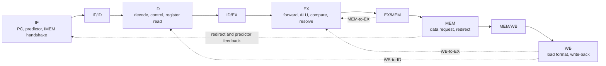

# RV32I Five-Stage Pipelined SoC

This project implements a 32-bit, single-issue, in-order RISC-V processor and a small FPGA SoC in SystemVerilog. The original single-cycle core has evolved into a five-stage pipeline with forwarding, load-use interlocks, synchronous local memories, memory-mapped GPIO, and a dynamic BTB+BHT branch predictor.

The current FPGA target is the Digilent Cmod A7. A Clocking Wizard converts the 12 MHz board clock to a 100 MHz CPU clock. The current design has reached timing closure at 100 MHz, and the button/LED GPIO program has been tested on hardware.

## Current Implementation

| Item | Implementation |
| --- | --- |
| ISA | RV32I subset listed below |
| Datapath | 32 bits |
| Pipeline | Five stages: IF, ID, EX, MEM, WB |
| Execution | Single issue, in order |
| Register file | 32 x 32-bit registers; `x0` is always zero |
| Memory architecture | Harvard instruction and data interfaces |
| Instruction memory | 8 KiB synchronous ROM with ready/valid flow control |
| Data memory | Synchronous local RAM behind the SoC data/MMIO interconnect |
| Branch predictor | 8-entry direct-mapped BTB and 32-entry 2-bit BHT |
| Reset vector | `0x0000_0000` |
| Endianness | Little-endian |
| FPGA clock | 100 MHz from a 12 MHz Cmod A7 input |

## System Hierarchy

```text
cmod_a7_top
`-- riscv_soc
    |-- riscv_cpu
    |   |-- instruction_fetch_stage_if
    |   |-- decode_stage_id
    |   |-- execute_stage_ex
    |   |-- memory_stage_mem
    |   |-- writeback_stage_wb
    |   |-- hazard
    |   `-- pipeline_registers
    |-- imem_if
    |-- address_resolver_mem
    |-- dmem_mem
    `-- gpio
```

- `cmod_a7_top` contains board-specific clock, reset, pin, and input-synchronization logic.
- `riscv_soc` contains the CPU, local memories, address decoding, and peripherals.
- `riscv_cpu` contains only the processor pipeline and exposes instruction and data interfaces.

## Pipeline



### IF

- Holds the PC and issues an IMEM request.
- Queries the BTB and BHT in parallel.
- Selects the predicted target or `PC + 4`.
- Gives a MEM-stage redirect priority over prediction.
- Captures the request PC and prediction metadata on `req_valid && req_ready`.
- Aligns the returned instruction with its PC, predicted PC, and predicted direction.

### ID

- Extracts instruction fields and generates the immediate.
- Generates ALU, memory, write-back, and control-flow controls.
- Reads `rs1` and `rs2`.
- Tracks whether each instruction really uses each source register.
- Implements WB-to-ID bypass in the register file.

### EX

- Selects MEM/WB forwarded operands.
- Performs ALU, address, shift, and comparison operations.
- Evaluates conditional branches.
- Detects direction misprediction with a one-bit comparison.
- Computes the recovery PC and BTB training target.
- Registers redirect and predictor feedback into EX/MEM.

### MEM

- Generates the external load/store request.
- Produces store byte strobes and lane-aligned data.
- Reports load/store misalignment.
- Applies the redirect registered in EX/MEM.
- Sends resolved branch/JAL information back to the predictor.

### WB

- Receives synchronous memory or MMIO read data.
- Selects and extends bytes, halfwords, or words.
- Selects the ALU result, load result, or `PC + 4`.
- Writes `rd` only for a valid pipeline entry.

## Pipeline Control and Hazards

Every pipeline boundary contains a `valid` bit. An entry with `valid = 0` is a bubble, regardless of its payload.

`pipeline_registers` owns all four boundaries and defines control priority:

- Reset clears IF/ID, ID/EX, EX/MEM, and MEM/WB.
- A load-use stall holds IF/ID and inserts a bubble into ID/EX.
- A MEM-stage redirect invalidates younger IF/ID, ID/EX, and next EX/MEM entries.
- Redirect has priority over a simultaneous stall.

### Forwarding

| Path | Values |
| --- | --- |
| MEM to EX | ALU result or `PC + 4` |
| WB to EX | ALU result or `PC + 4` |
| WB to ID | Final write-back value, including load data |

MEM forwarding has priority over WB forwarding. `EX/MEM.forward_data` is preselected between the ALU result and `PC + 4`, avoiding another write-back-source mux in the critical forwarding path.

### Load-Use Stall

DMEM has a one-cycle synchronous read latency. A dependent instruction is held in ID while the load is in EX and again while it is in MEM. The load reaches WB, where WB-to-ID bypass supplies the final value before the consumer enters EX.

This two-cycle policy avoids a long DMEM-to-WB-to-EX path and was selected to improve timing.

## Branch Predictor

### BTB

- 8 direct-mapped entries.
- Index: `PC[4:2]`.
- Tag: `PC[12:5]`, assuming execution remains inside the 8 KiB IMEM.
- Stores valid, tag, 32-bit target, and control-flow type.
- A taken conditional branch allocates an entry.
- JAL allocates an entry whenever it resolves.
- JALR is not predicted.

A JAL hit predicts taken unconditionally. A conditional hit uses the BHT. A miss predicts not-taken and selects `PC + 4`.

### BHT

- 32 entries indexed by `PC[6:2]`.
- Each entry is a 2-bit saturating counter.
- Reset state is weakly not-taken (`01`).
- The most-significant bit is the predicted direction.
- Every valid conditional branch trains the table.

```text
00 strongly not-taken
01 weakly not-taken
10 weakly taken
11 strongly taken
```

### Recovery

Conditional misprediction is detected with:

```systemverilog
predicted_taken != actual_taken
```

Direct branch and JAL targets are assumed stable for a matching BTB tag, removing a wide target-address comparison from the EX critical path. JALR remains unpredicted and always redirects to `(rs1 + imm) & ~1`.

Resolution occurs in EX, but the result is registered and applied in MEM. A redirect therefore flushes all younger instructions in IF, ID, and EX. The redirecting JAL/JALR itself continues and can write `PC + 4` to `rd`.

## Core Interfaces

### Instruction Interface

| Signal | Direction | Meaning |
| --- | --- | --- |
| `imem_req_valid_if` | CPU to memory | Request valid |
| `imem_req_ready_if` | Memory to CPU | Request accepted |
| `imem_req_addr_if` | CPU to memory | Instruction address |
| `imem_resp_valid_if` | Memory to CPU | Response valid |
| `imem_resp_ready_if` | CPU to memory | Response accepted |
| `imem_resp_data_if` | Memory to CPU | Instruction data |
| `imem_flush_if` | CPU to memory | Discard an outstanding wrong-path response |

`imem_if` holds `resp_valid` under backpressure. It can accept a request when no response is pending or when the current response is accepted in the same cycle.

### Data Interface

| Signal | Direction | Meaning |
| --- | --- | --- |
| `data_req_valid_mem` | CPU to SoC | Load/store request valid |
| `data_req_write_mem` | CPU to SoC | Write when 1, read when 0 |
| `data_req_addr_mem` | CPU to SoC | Byte address |
| `data_req_wdata_mem` | CPU to SoC | Lane-aligned store data |
| `data_req_wstrb_mem` | CPU to SoC | Byte write strobes |
| `data_resp_rdata_wb` | SoC to CPU | Read result returned in WB |

The data interface currently assumes the fixed read latency used by the local RAM and GPIO. It does not yet support data-side request-ready or response-valid backpressure.

## Memory Map

| Address | Device | Description |
| --- | --- | --- |
| `0x0000_0000`–`0x0000_1FFF` | IMEM | 8 KiB instruction ROM |
| `0x8000_0000`–`0x8FFF_FFFF` | DMEM decode region | Routed to local RAM |
| `0x4000_0000` | GPIO LED | Bit 0 drives `led[0]` |
| `0x4000_0004` | GPIO button | Bit 0 reports synchronized `btn[1]` |

The DMEM array is declared as 4096 words, but the current implementation indexes it with `addr[9:2]`. Only the low 1 KiB is uniquely addressed; higher addresses in the decoded DMEM region alias those locations.

### Local Memory Behavior

- IMEM is a 2048 x 32-bit synchronous ROM with `rom_style = block`.
- IMEM is initialized using `$readmemh(asm.mem, instr_rom)`.
- DMEM uses synchronous reads and clocked byte-lane writes.
- Load byte/halfword selection and extension occur in WB.
- Store byte/halfword placement occurs in MEM.

The `asm.mem` path is relative to the simulation or synthesis working directory. In Vivado, add `build/asm.mem` as a memory initialization source.

## GPIO and FPGA Wrapper

- `0x4000_0000` is a 32-bit LED register; bit 0 drives the board LED.
- `0x4000_0004` returns the push-button value in bit 0.
- `cmod_a7_top` synchronizes `btn[1]` with two flip-flops.
- The synchronizer handles metastability but does not debounce the button.
- `clk_wiz_0` generates 100 MHz from the 12 MHz `sysclk`.
- External `reset` is active high; the internal pipeline reset is active low.

## Supported Instructions

| Category | Instructions |
| --- | --- |
| Register arithmetic/logic | `ADD SUB SLL SLT SLTU XOR SRL SRA OR AND` |
| Immediate arithmetic/logic | `ADDI SLTI SLTIU XORI ORI ANDI SLLI SRLI SRAI` |
| Upper immediate | `LUI AUIPC` |
| Conditional branch | `BEQ BNE BLT BGE BLTU BGEU` |
| Jump | `JAL JALR` |
| Load | `LB LH LW LBU LHU` |
| Store | `SB SH SW` |

`FENCE`, system/CSR instructions, privilege modes, interrupts, and the M/A/F/D/C extensions are not implemented.

## Module Reference

### Board and SoC

| File | Module | Responsibility |
| --- | --- | --- |
| `cmod_a7_top.sv` | `cmod_a7_top` | Clocking Wizard, reset, button synchronizer, and board pins |
| `riscv_soc/riscv_pkg.sv` | `riscv_pkg` | ISA constants, control enums, pipeline structures, MMIO and predictor types |
| `riscv_soc/riscv_soc.sv` | `riscv_soc` | CPU, memory, address decoder, GPIO, and read-data mux integration |
| `riscv_soc/imem_if.sv` | `imem_if` | Synchronous IMEM and ready/valid response holding |
| `riscv_soc/dmem_mem.sv` | `dmem_mem` | Synchronous RAM with byte write strobes |
| `riscv_soc/address_resolver_mem.sv` | `address_resolver_mem` | DMEM/GPIO decode and registered WB source selection |
| `riscv_soc/gpio.sv` | `gpio` | LED register and button readback |

### CPU Stages and Control

Paths in the following two tables are relative to `riscv_soc/`.

| File | Module | Responsibility |
| --- | --- | --- |
| `cpu_core/cpu_core.sv` | `riscv_cpu` | Five-stage core integration and external memory interfaces |
| `cpu_core/if/frontend_if.sv` | `frontend_if` | PC, predictor, IMEM handshake, redirect, and IF/ID payload |
| `cpu_core/id/decode_stage_id.sv` | `decode_stage_id` | Decoder, control, immediate generation, register file, and ID/EX payload |
| `cpu_core/ex/execute_stage_ex.sv` | `execute_stage_ex` | Forwarding, comparator, ALU, resolver, and EX/MEM payload |
| `cpu_core/mem/memory_stage_mem.sv` | `memory_stage_mem` | Data request, store format, alignment, redirect, and MEM/WB payload |
| `cpu_core/wb/writeback_stage_wb.sv` | `writeback_stage_wb` | Load format, write-back selection, and WB forwarding |
| `cpu_core/pipeline_registers.sv` | `pipeline_registers` | Pipeline boundary registers and reset/stall/flush priority |
| `cpu_core/hazard.sv` | `hazard` | Forwarding selection and load-use detection |

### CPU Leaf Modules

| File | Module | Responsibility |
| --- | --- | --- |
| `cpu_core/if/pc_if.sv` | `pc_if` | Program-counter register |
| `cpu_core/if/branch_predict_if.sv` | `branch_predict_if` | BTB/BHT lookup and training |
| `cpu_core/id/decoder_id.sv` | `decoder_id` | Instruction field extraction and immediate classification |
| `cpu_core/id/control_id.sv` | `control_id` | Instruction control decode and illegal-instruction flag |
| `cpu_core/id/registers_id.sv` | `registers_id_wb` | Register file and WB-to-ID bypass |
| `cpu_core/id/imm_gen_id.sv` | `imm_gen_id` | RV32I immediate reconstruction |
| `cpu_core/ex/comparator_ex.sv` | `comparator_ex` | Equality and signed/unsigned comparisons |
| `cpu_core/ex/branch_ex.sv` | `branch_ex` | Conditional branch decision |
| `cpu_core/ex/alu_ex.sv` | `alu_ex` | Arithmetic, logic, shift, and comparison operations |
| `cpu_core/ex/control_flow_resolver_ex.sv` | `control_flow_resolver_ex` | Redirect, recovery PC, and predictor feedback generation |
| `cpu_core/mem/lsu_mem.sv` | `lsu_mem` | Store formatting and alignment checks |
| `cpu_core/wb/lsu_wb.sv` | `lsu_wb` | Load selection and extension |

## Building Programs

Required tools:

- GNU Make.
- A RISC-V GNU toolchain using the `riscv64-unknown-elf-` prefix.
- Vivado or another SystemVerilog tool.

Build from `src`:

```sh
make PRGM=branch_test
```

The Makefile uses `-march=rv32i -mabi=ilp32 -nostdlib`, places `_start` at `0x0000_0000`, and creates:

```text
build/asm.elf   linked executable
build/asm.mem   Verilog-format instruction image
build/asm.dump  disassembly
```

## Simulation and Tests

`cpu_tb.sv` instantiates `riscv_soc`, generates a 100 MHz clock, applies reset, and stops after 300 cycles. It is primarily a waveform testbench; assembly programs perform most architectural checks.

Compile `riscv_soc/riscv_pkg.sv` before modules that import it. Then compile CPU modules, SoC devices, `riscv_soc/riscv_soc.sv`, and finally the selected top/testbench.

| Program | Main coverage |
| --- | --- |
| `asm/asm.s` | Basic byte, halfword, and word accesses |
| `asm/branch_test.s` | Branch conditions, flushes, backward-loop BHT training, and JAL BTB behavior |
| `asm/dmem_test.s` | Synchronous DMEM, widths, sign extension, strobes, and address resolution |
| `asm/forward_test.s` | Basic forwarding |
| `asm/forward_test2.s` | Forwarding priority, WB-to-ID bypass, load-use stalls, branch dependencies, JAL/JALR |
| `asm/for.s` | Repeated not-taken BHT training and JAL loop prediction |
| `asm/findmax.s` | Mixed branch-direction transitions with memory traffic |
| `asm/sum.s` | Function call, memory loop, and return |
| `asm/memcpy.s` | Memory copy, function call, result checks, and return |
| `asm/gpio_test.s` | Toggle the LED once per button press/release cycle |

`branch_test.s`, `dmem_test.s`, and `forward_test2.s` use `x31` as:

```text
0x0000_0000 running
0x0000_0001 pass
0xFFFF_FFFF fail
```

## Current Limitations

- Exceptions are observed internally but are not connected to a complete trap/CSR mechanism.
- Misaligned accesses do not yet guarantee side-effect suppression.
- The data interface cannot wait for variable-latency devices.
- JALR is not predicted; there is no return-address stack.
- There are no caches, global-history predictor, or predictor performance counters.
- The BTB tag assumes execution remains in the current 8 KiB IMEM.
- IMEM and DMEM do not raise out-of-range access faults.
- Only 1 KiB of the current DMEM is uniquely indexed.
- The button is synchronized but not debounced.
- Clock Wizard `locked` is not used to qualify reset release.
- The testbench is not a full instruction-level self-checking environment.

## Directory Structure

```text
src/
|-- cmod_a7_top.sv
|-- cmod_a7.xdc
|-- cpu_tb.sv
|-- Makefile
|-- script.tcl
|-- script_lite.tcl
|-- readme.md
|-- asm/
|-- build/
`-- riscv_soc/
    |-- riscv_pkg.sv
    |-- riscv_soc.sv
    |-- imem_if.sv
    |-- dmem_mem.sv
    |-- address_resolver_mem.sv
    |-- gpio.sv
    `-- cpu_core/
        |-- cpu_core.sv
        |-- pipeline_registers.sv
        |-- hazard.sv
        |-- if/
        |   |-- frontend_if.sv
        |   |-- branch_predict_if.sv
        |   `-- pc_if.sv
        |-- id/
        |   |-- decode_stage_id.sv
        |   |-- decoder_id.sv
        |   |-- control_id.sv
        |   |-- registers_id.sv
        |   `-- imm_gen_id.sv
        |-- ex/
        |   |-- execute_stage_ex.sv
        |   |-- alu_ex.sv
        |   |-- comparator_ex.sv
        |   |-- branch_ex.sv
        |   `-- control_flow_resolver_ex.sv
        |-- mem/
        |   |-- memory_stage_mem.sv
        |   `-- lsu_mem.sv
        `-- wb/
            |-- writeback_stage_wb.sv
            `-- lsu_wb.sv
```

After moving RTL files, update the Vivado project's explicit source paths and reset synthesis/implementation runs. Vivado does not automatically follow filesystem moves.
